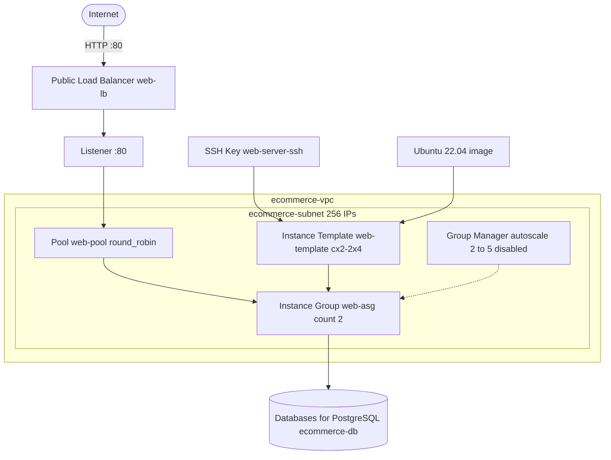

<div align="center">

# ibm-ecommerce-infra


**Terraform infrastructure as code that provisions an IBM Cloud VPC web tier with an autoscaling instance group, a public load balancer, and a managed PostgreSQL database.**

</div>

> [!NOTE]
> This is a working learning and demo project. It builds the network, compute, load balancing, and database layers for an ecommerce style web tier on IBM Cloud. A few resources are intentionally commented out in the code (a standalone instance and a load balancer pool member). The autoscale manager is created but disabled by default. See [Roadmap](#roadmap) and [Configuration](#configuration) for details.

## Table of Contents

- [About](#about)
- [What It Provisions](#what-it-provisions)
- [Tech Stack](#tech-stack)
- [Architecture](#architecture)
- [Getting Started](#getting-started)
- [Usage](#usage)
- [Variables](#variables)
- [Project Structure](#project-structure)
- [Configuration](#configuration)
- [Roadmap](#roadmap)
- [Contributing](#contributing)
- [License](#license)

## About

`ibm-ecommerce-infra` is a Terraform configuration for IBM Cloud. It stands up the core infrastructure that a simple web application would need: a private network, a pool of identical web servers that can scale, a public load balancer in front of them, and a managed PostgreSQL database for application data.

The whole stack is defined as code across a handful of `.tf` files. You supply an IBM Cloud API key and an SSH public key, then run the standard Terraform workflow to create everything in one go. The default region is `eu-gb` (London).

The repository is single environment and does not configure a remote state backend, so Terraform keeps state locally by default.

## What It Provisions

- VPC named `ecommerce-vpc` in the Default resource group.
- A subnet (`ecommerce-subnet`) with 256 IPv4 addresses in zone `<region>-1`.
- An SSH key (`web-server-ssh`) built from your supplied public key.
- A compute instance template (`web-template`) using the `cx2-2x4` profile and an Ubuntu 22.04 minimal image.
- An instance group (`web-asg`) that runs 2 instances and registers them with the load balancer pool on port 80.
- An instance group manager (`web-asg-manager`) of type `autoscale`, with membership between 2 and 5. It is created with `enable_manager = false`, so autoscaling is off until you turn it on.
- A public application load balancer (`web-lb`).
- A load balancer pool (`web-pool`) using round robin with an HTTP health check on `/`.
- A load balancer listener (`web-listener`) on port 80 over HTTP.
- A managed PostgreSQL database (`ecommerce-db`) using IBM Databases for PostgreSQL on the standard plan with a public service endpoint.

## Tech Stack

| Layer | Technology |
|-------|------------|
| IaC tool | Terraform (HCL) |
| Cloud | IBM Cloud |
| Provider | `IBM-Cloud/ibm` (>= 1.60.0, locked at 1.77.0) |
| Network | IBM Cloud VPC, subnet |
| Compute | VPC instance template, instance group, instance group manager |
| Load balancing | VPC application load balancer, pool, listener |
| Database | IBM Databases for PostgreSQL |
| OS image | Ubuntu 22.04 minimal (amd64) |

## Architecture



## Getting Started

### Prerequisites

- [Terraform](https://developer.hashicorp.com/terraform/install) installed.
- An IBM Cloud account and an [IBM Cloud API key](https://cloud.ibm.com/docs/account?topic=account-userapikey).
- The [IBM Cloud CLI](https://cloud.ibm.com/docs/cli) (optional, useful for checking resources).
- An SSH public key for access to the instances.

### Setup

```bash
git clone https://github.com/atiqbitstream/ibm-ecommerce-infra.git
cd ibm-ecommerce-infra
```

Provide the required variables. The simplest way is a `terraform.tfvars` file (it is git-ignored, so it stays out of version control):

```hcl
ibmcloud_api_key = "your-ibm-cloud-api-key"
ssh_public_key   = "ssh-rsa AAAA... your-public-key"
region           = "eu-gb"
```

## Usage

Run the standard Terraform workflow:

```bash
terraform init
terraform plan
terraform apply
```

To tear everything down:

```bash
terraform destroy
```

## Variables

| Variable | Description | Type | Default |
|----------|-------------|------|---------|
| `ibmcloud_api_key` | IBM Cloud API key, used by the provider to authenticate. | string (sensitive) | none, required |
| `ssh_public_key` | Public SSH key for accessing the instances. | string (sensitive) | none, required |
| `region` | IBM Cloud region the resources are created in. | string | `eu-gb` |

## Project Structure

```text
ibm-ecommerce-infra/
├── provider.tf          # IBM provider and Terraform required_providers block
├── variables.tf         # Input variables (API key, SSH key, region)
├── vpc.tf               # VPC, subnet, SSH key, image and resource group data
├── auto_scaling.tf      # Instance template, instance group, group manager
├── load_balancer.tf     # Load balancer, pool, and listener
├── database.tf          # Databases for PostgreSQL instance
├── infra-graph.svg      # Rendered dependency graph of the resources
├── .terraform.lock.hcl  # Provider dependency lock file
└── .gitignore           # Ignores state, .tfvars, and local Terraform files
```

## Configuration

A few things are worth knowing before you apply:

- **Autoscaling is off by default.** The instance group manager is created with `enable_manager = false`. The group runs a fixed count of 2 instances until you enable the manager. Note that IBM Cloud does not allow changing the instance count manually while the autoscale manager is active.
- **Commented out resources.** A standalone `ibm_is_instance` web server and an `ibm_is_lb_pool_member` resource are present in the code but commented out. The instance group already attaches members to the pool, so the pool member resource is not needed in the active configuration.
- **Database credentials.** The PostgreSQL admin password is currently hardcoded in `database.tf`. This should be replaced with a variable (see Roadmap). Do not reuse the committed value.
- **Service endpoint.** The database uses a public service endpoint. For production you would typically use private endpoints.
- **State.** No remote backend is configured, so state is stored locally. For team use, configure a remote backend.

## Roadmap

- [ ] Move the database admin password out of `database.tf` into a sensitive variable.
- [ ] Add a remote state backend for team and CI use.
- [ ] Add `output` values for the load balancer hostname and database connection details.
- [ ] Enable the autoscale manager and tune scaling policies.
- [ ] Switch the database to a private service endpoint.
- [ ] Add a separate `.tfvars` example file and per environment workspaces.

## Contributing

Contributions are welcome. Open an issue to discuss a change, or send a pull request. Please keep Terraform formatting consistent by running `terraform fmt` before submitting.

## License

Distributed under the MIT License. See [LICENSE](LICENSE).
